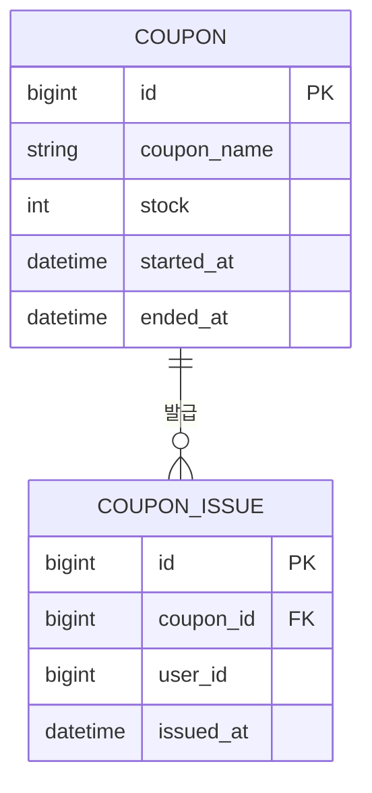

# 쿠폰 ERD

요구사항: [README.md](../README.md)

## 제약 조건

**유니크 제약을 걸지 않는다.**
`(coupon_id, user_id)` 유니크 제약으로 1인 1매(FR-02)를 보장할 수 있지만,
요구사항이 바뀌면(1인 N매 허용 등) 스키마 변경이 필요해진다.
중복 방지는 애플리케이션 로직에서 처리하고 테이블에는 제약을 두지 않는다.

이 선택의 결과로, 동시성 제어가 없는 v1 에서는 **수량 초과와 중복 발급이 모두 재현**된다.
락은 "조회 → 검증 → 삽입" 구간 전체를 덮어야 한다.
